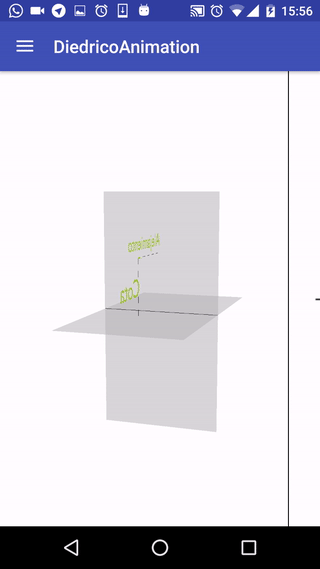
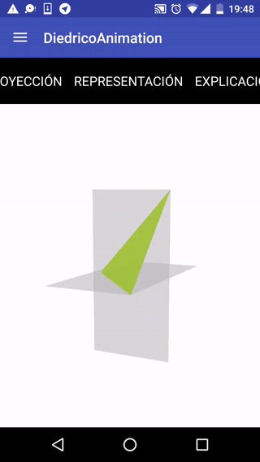

En la [última entrada](/Estado-del-proyecto/) ya expliqué como fue avanzando el proyecto desde sus inicios. Para agosto el proyecto lucía así:  

  
 
Para principios de agosto, cuando le enseñé el proyecto a Jorge Martín ([@arasthel92](https://twitter.com/arasthel92)), desarrollador android muy experimentado, me dijo que la experiencia de usuario es como los chistes malos, si tienes que explicar en que consiste el chiste, es que es muy malo. Palabras textuales de Jorge al ver  DiedricoApp en esas fechas, “*La experiencia de usuario es cuanto menos curiosa*”. Era obvio que necesitaba un cambio en el diseño.

La forma más cómoda que vi para solucionar el problema de diseño era quitando todo la cosa rara que había hecho y poner tres pestañas, al estilo twitter en android, y cada una con una herramienta: Proyección, plano del dibujo y explicación.

Para hacerlo de una forma sencilla lo más coherente era coger alguna herramienta ya desarrollada en github, y la más simple fue [esta](https://github.com/noties/Scrollable). Consistía en una librería para *android* que estaba liberada bajo la licencia *Apache 2.0*, con lo que no habría problema en utilizarla. La herramienta la tenías que importar y adaptar el código para que funcionase. 

Para poder usar esta librería tenía que adaptar todo el código para que funcionase con *fragments*, cuando antes funcionaba con directamente *Activities*. Con esta fase tuve bastantes problemas porque al principio el *Renderer* de *OpenGl ES* no se visualizaba, eso me retrasó algunos días, hasta que me di cuenta de que me faltaba un método (*EPIC FAIL*). Además tuve que modificar muchas lineas de código para hacer las mismas funciones que antes tenía, pero en los *fragment*, como cambiar el *renderer* cuando se cambia de tipo de linea, poder visualizar la información, que el plano del dibujo cambiase cuando cambias de *renderer*, etc.

Eso me llevó algunas semanas hasta que ya, más o menos, la aplicación empezó a coger forma otra vez. El resultado se quedó así:  

  

Claramente hay una mejora en cuanto al diseño, pero sigue habiendo algunos problemas que iré solucionando en los próximos días.

amil101@debian:~$ EXIT
