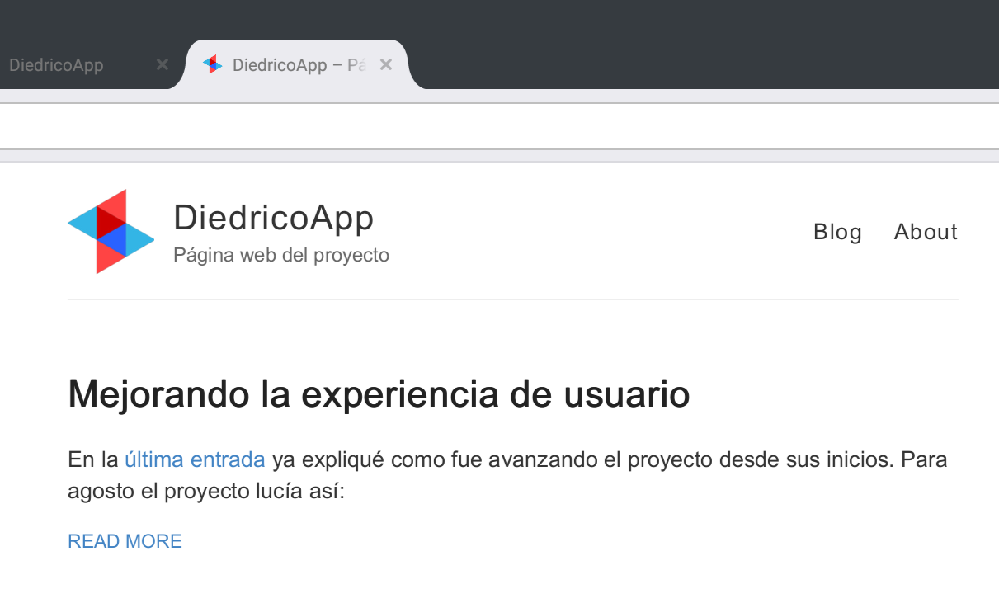
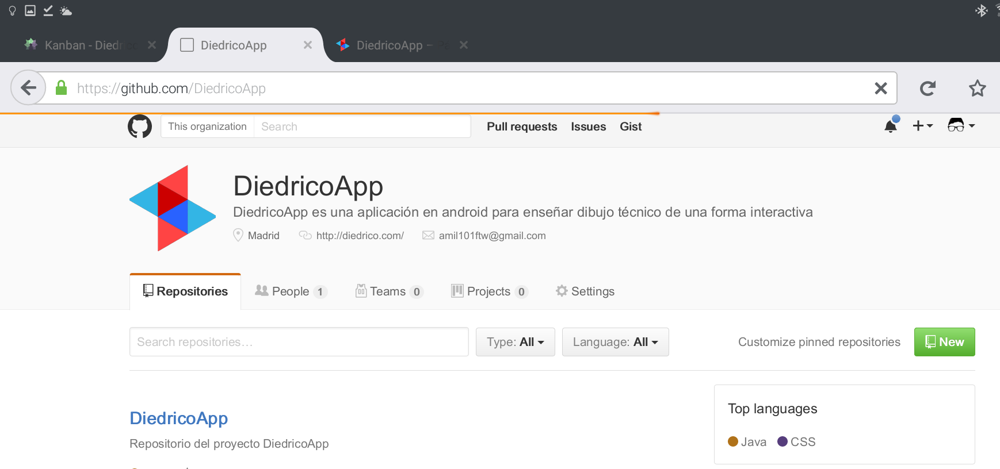
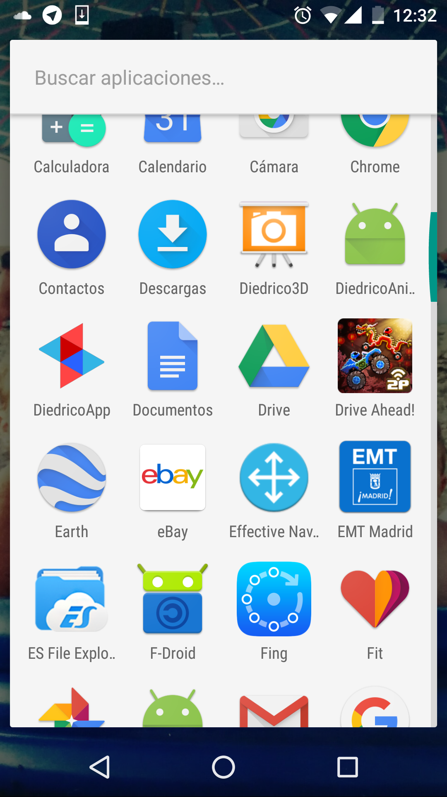
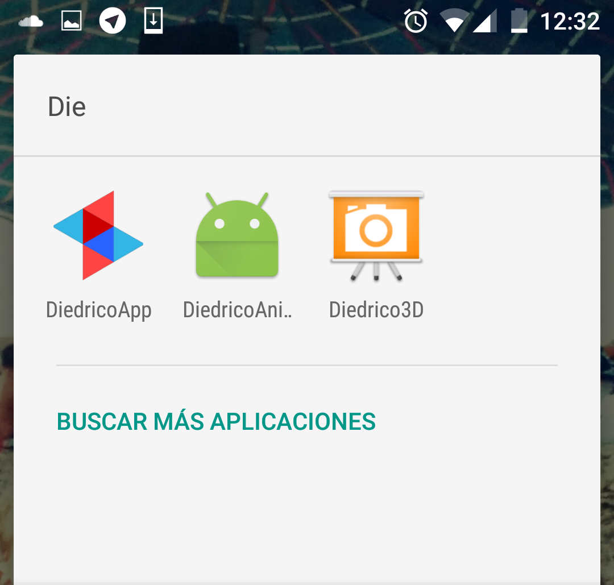

Ahora la aplicación reluce mucho más porque tiene un nuevo logo. Algunos ejemplos de como quedarán las herramientas:  

  
  
  
  

Está desarrollado en Inkscape (General Public License) y juega con las formas del eje de coordenadas del sistema diédrico. La paleta de colores es sacada de la página de [*Android developers*](https://material.io/guidelines/style/color.html).

Para llegar al resultado que hay, lo que hice fue crear un eje de coordenadas en FreeCAD, modelador 3D, hice una captura y la pasé a Inkscape. Luego pasé la imagen el eje de coordenadas a vectorial y luego fui coloreando con la paleta antes mencionada. El resultado es el siguiente:

  

El proyecto de Inkscape [aquí](../images/LogoDiedricoApp.svg).
