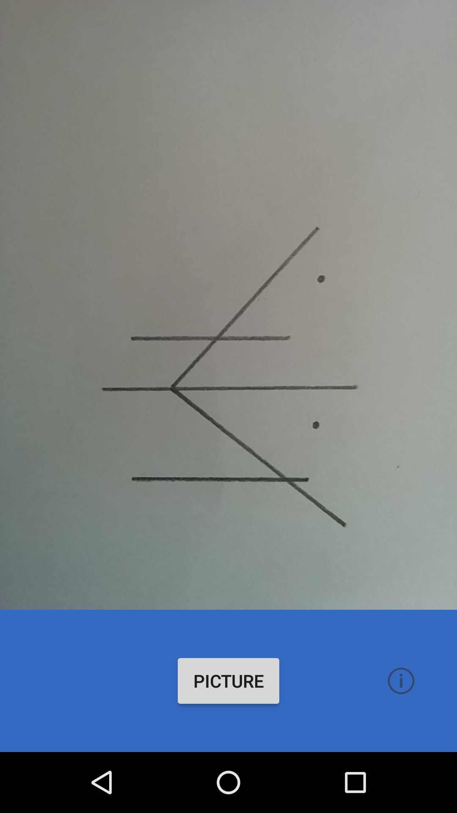
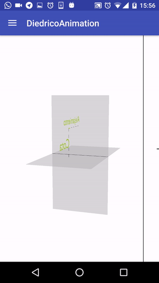

Puesto que el proyecto ha evolucionado durante este último año, voy a intentar explicar las **dos etapas** del proyecto que serían *desde enero de 2016 hasta agosto 2016* y la otra etapa de *septiembre de 2016 hasta el momento*.

## Primera etapa (Enero 2016 - Agosto 2016)
El proyecto de DiédricoApp comenzó en un curso de Android impartido por Victor Suarez y luego su desarrollo fue motivado por la gente de HackLab Almería. El repositorio donde se realizó fue [este](https://github.com/acien101/DiedricoApp). La cronología del proyecto ya está explicado en la entrada anterior pero quiero explicar detalladamente como evolucionó el proyecto en esos meses.

La idea empezó en Enero de cuando yo cursaba segundo de bachillerato, con el objetivo de crear una aplicación para pasar una lámina de dibujo técnico a tres dimensiones. En abril conseguí tener un prototipo medianamente aceptable, y lo desarrollé en la carpeta [/DiedricoTo3D](https://github.com/acien101/DiedricoApp/tree/master/DiedricoTo3D) .Foto del prototipo a mediados de Abril de 2016:  

Como ese objetivo estaba resuelto, el siguiente objetivo fue que la aplicación fuese capaz de enseñarte dibujo técnico con animaciones y elementos interactivos. Desde abril hasta julio me dediqué a hacer animaciones, y las hice en la carpeta [/DiedricoAnimation](https://github.com/acien101/DiedricoApp/tree/master/DiedricoAnimation). Foto del prototipo:  

Como se ve, hay mucha documentación, pero la experiencia de usuario, es muy muy mala. El siguiente objetivo era mejorarla y añadir nuevas funciones.

Como he puesto anteriormente, el proyecto estaba dividido en dos carpetas. En mi opinión, eso fue un tremendo error, *como las carpetas con nombre asdf*, que empezó como algo temporal hasta que la bola era tan grande que no sabía como organizarlo bien.

Por este motivo, sale la segunda etapa del proyecto, para juntar estas dos ramas, arreglar todos los errores, y mejorar la experiencia de usuario.

## Segunda etapa (Septiembre 2016 - actualidad)
Para poder crear este blog en github pages, tuve que crear en github la organización llamada [DiedricoApp](https://github.com/DiedricoApp). Con esta excusa cree el repositorio [DiedricoApp](https://github.com/DiedricoApp/DiedricoApp) para unir estas dos ramas y mejorarlas para que puedan llegar a ser un producto al público. Por esto mismo, el proyecto final se irá desarrollando en ese repositorio.

La parte mala es que hay mucha documentación y código interesante en el antiguo repositorio, pero, por bien de la organización y de la gente que esté interesada en el proyecto, es mejor tener todo en una organización de github.

## Futuro del proyecto
Las cosas que están pendientes por hacer son:
··* Mejorar la UX (user experience)
··* Añadir reconocimiento de láminas (mejor detección en qué es cada cosa)
··* Añadir nuevas funciones para mejorar la experiencia en telefonos móviles
··* Añadir documentación
··* Mejorar la calidad del código
··* Hacer una API de todas las funciones usadas
··* Muchas cosas más...

Esto es todo por el momento. Iré subiendo los avances.  

amil101@debian:~$ EXIT
