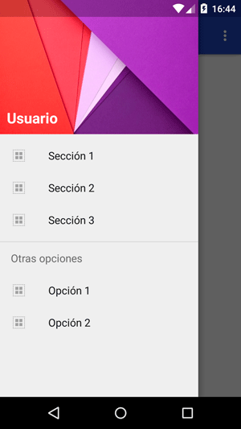
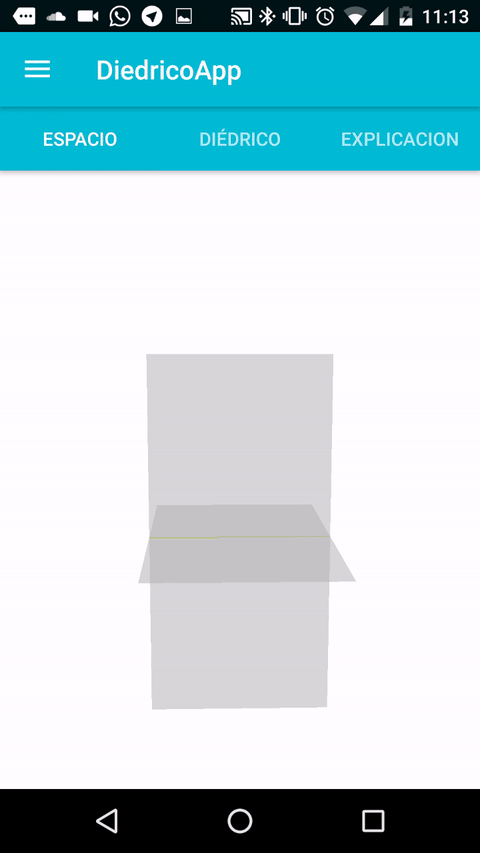

La aplicación está avanzando y ha llegado al punto en el que tenemos mucha documentación, pero hay que ordenarla con nuestro objetivo de tener una UX (*user experience*) presentable. La mejor solución es utilizar un Navigation View.

## ¿Qué es un NavigationView?
NavigationView es una herramienta que se implementó en Android con el objetivo de organizar las aplicaciones poniendo un menú de navegación lateral.   

<br>

Para implementarlo hay que poner:

```
<android.support.design.widget.NavigationView
        android:id="@+id/navview"
        android:layout_width="wrap_content"
        android:layout_height="match_parent"
        android:fitsSystemWindows="true"
        android:layout_gravity="start"
        app:headerLayout="@layout/header_navview"
        app:menu="@menu/menu_navview" />

```

Nuestro objetivo es poner todos los tipos de planos, todos los tipos de lineas, capítulos y demás para que el usuario pueda acceder rápidamente. Para ello voy a utilizar ExpandableListView's donde tengan estos elementos. Para utilizarlo se poner tal que así:

```
<ExpandableListView
                android:layout_width="match_parent"
                android:layout_height="wrap_content"
                android:layout_marginTop="30dp"
                android:id="@+id/expandableListView"
                android:indicatorRight="500dp"
                android:childDivider="#00FFFFFF">
            </ExpandableListView>
```

Luego hay que modificar el adapter para que funcione como queramos. Lo que he hecho es que he puesto todos los menus en array's en Resources, y luego los voy metiendo en el ExpandableListView. El código se puede encontrar [aquí](https://github.com/DiedricoApp/DiedricoApp/blob/master/DiedricoApp/app/src/main/java/com/diedrico/diedricoapp/MainActivity.java).

El resultado final es:  
<br>

amil101@debian:~$ EXIT
