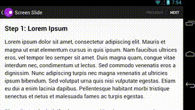
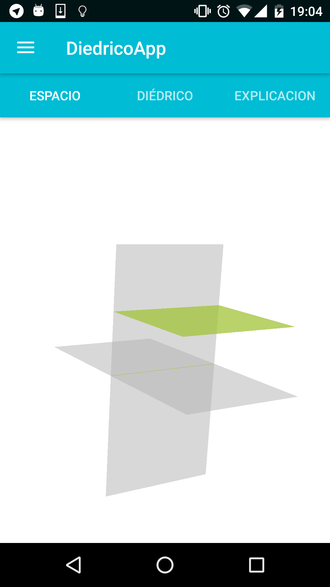

Como enseñé anteriormente en el artículo de [*Mejorando la UX*](/Mejorando-la-UX/) lo que estaba utilizando hasta ahora, para seleccionar si querías ver la proyección 3D, el plano o la explicación, eran unas pestañas que eran parte de una librería que directamente la importabas y te ponía todo el tema de las pestañas, pero no me terminaba de gustar.

Empezando por el problema de que las pestañas están mal puestas, y terminando con que la personalización es mala, decidí crear mis propias pestañas. Al estilo Juan Palomo -*Yo me lo guiso, yo me lo como*.-

*Android* tiene una *view* llamada *ViewPager* que se utiliza es poner diferentes fragments y poder movernos entre ellos deslizando con el dedo. Un ejemplo [de la página de google](https://developer.android.com/training/animation/screen-slide.html):

  
 
Con el ViewPager conseguimos que los fragments (las pantallas como la proyección, el plano o la explicación) se puedan deslizar con el dedo. Para poner las pestañas, *android* nos ofrece un widget llamado [TabLayout](https://developer.android.com/reference/android/support/design/widget/TabLayout.html) con el podemos poner los fragment y ya lo configura todo.

En mi caso lo he customizado un poco y he creado un Adapter al ViewPage, para que sea más sencillo añadir los fragment.

El resultado final es tal que así:

  

amil101@debian:~$ EXIT
