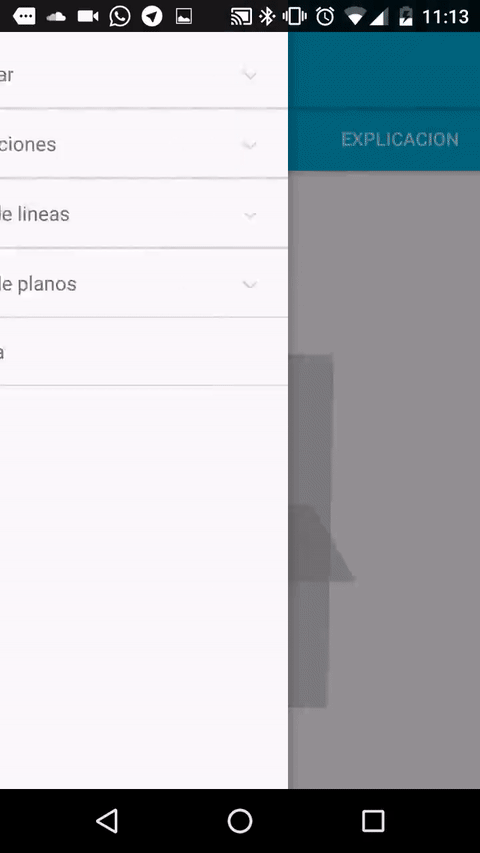

El proyecto ya está cogiendo forma y está bastante definido. En esta entrada intentaré explicar como se divide el proyecto con el objetivo de que la gente que quiera coolaborar/aprender no pierda mucho tiempo investigando como funciona el código.

DiedricoApp se divide en **dos partes**, una para explicar la materia y otra para pasar de una foto con la cámara a un sistema tridimensional.

**La primera parte** que es con la que se abre la aplicación es para explicar como funciona el sistema diédrico a través de animaciones. La principal clase es [MainActivity](https://github.com/DiedricoApp/DiedricoApp/blob/master/DiedricoApp/app/src/main/java/com/diedrico/diedricoapp/MainActivity.java) que organiza los 3 fragments con unas pestañas que ya hablé en el blog de [cómo funcionaban](http://diedrico.com/Cambiando-las-pesta%C3%B1as/). Estos tres fragments son:
* [ProjectionFragment](https://github.com/DiedricoApp/DiedricoApp/blob/master/DiedricoApp/app/src/main/java/com/diedrico/diedricoapp/ProjectionFragment.java): es la encargada de enseñar la vista diédrica en 3 dimensiones, lo hace gracias a OpenGL con las coordenadas que le va pasando el MainActivity.
* [DiedricoFragment](https://github.com/DiedricoApp/DiedricoApp/blob/master/DiedricoApp/app/src/main/java/com/diedrico/diedricoapp/DiedricoFragment.java): es la encargada de poner la vista diédrica en 2 dimensiones, se hace a partir de las coordenadas y por medio de la clase CreateDiedrico que genera un Bitmap con la representación.
* [ExplanationFragment](https://github.com/DiedricoApp/DiedricoApp/blob/master/DiedricoApp/app/src/main/java/com/diedrico/diedricoapp/ExplanationFragment.java): se dedica a poner la explicación en la pantalla.

Por tanto, la clase de MainActivity gestiona todos los fragments enviando a cada uno de ellos el contenido que tiene que gestionar. También se encarga de gestionar el NavigationView (el menu desplegable) para que el usuario vaya a la materia que quiere recibir documentación.

 

La **segunda parte del proyecto** empieza con al clase [Camera2BasicFragment](https://github.com/DiedricoApp/DiedricoApp/blob/master/DiedricoApp/app/src/main/java/com/diedrico/diedricoapp/Camera2BasicFragment.java) que es un fragment de la página de Android para hacer fotos lo mejor posible, poniendo el flash si hay poca luz y autoenfocando. Una vez se coge la imagen se envía a [CameraActivity](https://github.com/DiedricoApp/DiedricoApp/blob/master/DiedricoApp/app/src/main/java/com/diedrico/diedricoapp/CameraActivity.java) que la pasa por las clases [Thresholding](https://github.com/DiedricoApp/DiedricoApp/blob/master/DiedricoApp/app/src/main/java/com/diedrico/diedricoapp/picToDiedrico/Thresholding.java), para aplicar un filtro de blanco y negro (para que el análisis sea más sencillo), y [PicAnalyzer](https://github.com/DiedricoApp/DiedricoApp/blob/master/DiedricoApp/app/src/main/java/com/diedrico/diedricoapp/picToDiedrico/PicAnalyzer.java), que coge los puntos y las lineas interesantes. Después de coger todos los puntos y las lineas interesantes se pasa por unos filtros para eliminar las imperfecciones. Una vez que está toda la imagen mapeada se organizan en grupos de cota y alejamiento y por medio de trigonometría se saca su posición en el espacio. Y de ahí se envía a OpenGL para que la represente en 3 dimensiones. 

  

amil101@debian:~$ EXIT
