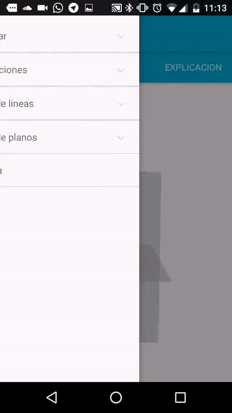

El proyecto ya está cogiendo forma y está bastante definido, así que intentaré echar la vista atrás para ver cómo ha evolucionado en el último año. En el segundo post puse la situación en la que estaba el proyecto en septiembre de 2016 y cuales eran los objetivos:

---

La idea empezó en Enero de cuando yo cursaba segundo de bachillerato, con el objetivo de crear una aplicación para pasar una lámina de dibujo técnico a tres dimensiones. En abril conseguí tener un prototipo medianamente aceptable, y lo desarrollé en la carpeta [/DiedricoTo3D](https://github.com/acien101/DiedricoApp/tree/master/DiedricoTo3D).Foto del prototipo a mediados de Abril de 2016:  

Como ese objetivo estaba resuelto, el siguiente objetivo fue que la aplicación fuese capaz de enseñarte dibujo técnico con animaciones y elementos interactivos. Desde abril hasta julio me dediqué a hacer animaciones, y las hice en la carpeta [/DiedricoAnimation](https://github.com/acien101/DiedricoApp/tree/master/DiedricoAnimation). Foto del prototipo:  

Como se ve, hay mucha documentación, pero la experiencia de usuario, es muy muy mala. El siguiente objetivo era mejorarla y añadir nuevas funciones.

## Futuro del proyecto
Las cosas que están pendientes por hacer son:  

* Mejorar la UX (user experience)  
* Añadir reconocimiento de láminas (mejor detección en qué es cada cosa)  
* Añadir nuevas funciones para mejorar la experiencia en telefonos móviles  
* Añadir documentación  
* Mejorar la calidad del código  
* Hacer una API de todas las funciones usadas  
* Muchas cosas más...  

Esto es todo por el momento. Iré subiendo los avances.  

---

Ahora la app es totalmente diferente y reluce así:

Una cosa que estuvo implementada hace tiempo era lo de pasar una lámina a un espacio tridimensional, pero su uso era muy complicado porque la experiencia de usuario era muy mala. Por ese motivo, y por falta de tiempo, he prescindido de meterla a la fuerza y seguir trabajando en el futuro para que sea una herramienta de calidad. El principal problema que tenía en el pasado era que el usuario tenía que decirle al programa que había en la imagen, aunque el objetivo que nos marcamos era de que la aplicación fuese capaz de adivinar lo que había. Esto se está llevando ha cabo y funciona como ya vimos en [Visión artificial en Android](../Visión-artifial-en-Android/). Pero como no son compatibles una cosa con la otra, he optado por prescindir de ella por ahora, y seguir trabajando para que ese objetivo sea posible de la mejor forma posible.

* El objetivo de mejorar la UX(user experience) se ha mejorado rotundamente. Se ha hecho el [NavigationView de una forma más ordenada](../NavigationView-con-ExpandableListView), se ha cambiado toda la interfaz por [fragments y por pestañas](../Cambiando-las-pestañas). Además se ha [creado un logo](Nuevo-logo/) y el blog que estás visitando. Se han ordenado los repositorios, creando la organización de [DiedricoApp en github](https://github.com/diedricoapp).

* El objetivo de añadir reconocimiento de láminas se ha mejorado pero está todavía en proceso. Como ya expliqué en el artículo de [Visión artificial en Android](../Visión-artifial-en-Android/) había hecho unos cuantos filtros para eliminar las imperfecciones de las imagenes. El resultado final es que funciona pero no del todo, hace falta dedicarle más tiempo y que sea capaz de reconocer las láminas al 100%. Pero, por lo menos, está por buen camino.

* El objetivo de *Añadir nuevas funciones para mejorar la experiencia en telefonos móviles* no está muy trabajado, aunque hay algún intento de ello en trabajo. Poco a poco iré poniendo el resultado de mi avanze.

* Una cosa que he tenido muy presente desde que empezé en septiembre con el proyecto era que había que limpiar el código, y el resultado es que hay un código bonito y fácil de arreglar. Se han vuelto a pensar todas las clases, se han escrito otra vez, y se ha hecho un código limpio. 

* No se ha hecho una API con las funciones utilizadas, pero las clases están muy abiertas para utilizarlas en cualquier proyecto. Esto tiene mucho que ver con el último objetivo, pues se ha intentado hacer una programación de calidad para poder reutilizar gran parte del código en otros proyecto relacionados con BoofCV, OpenGL, NavigationView, y todas las funciones utilizadas.

En lineas generales se ha hecho mucho desde sus inicios aunque todavía le queda mucho por recorrer, terminando los objetivos que están a medias y los nuevos que están suergiendo. Así pues, los nuevos objetivos serían:
* Terminar de meter todo el tema para pasar una lámina a un espacio tridimensional. 
* Mejorar la UX en cuando se pasan las láminas a un espacio tridimensional.
* Mejorar los filtros para la visión artificial.
* Meter más documentación con más animaciones.
* Dar los últimos retoques a la aplicación.

amil101@debian:~$ EXIT
